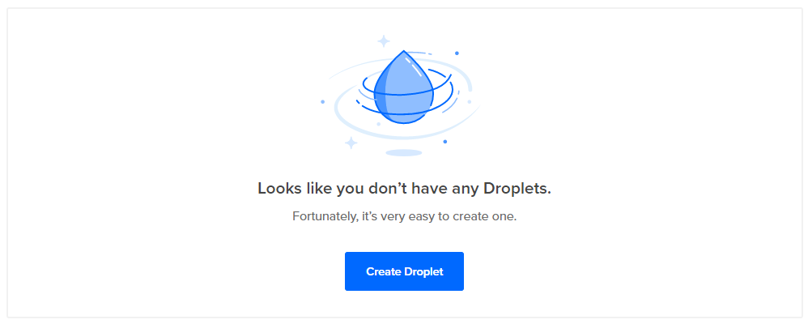
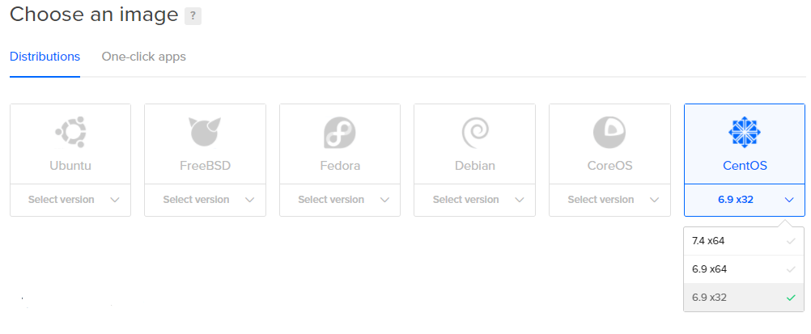
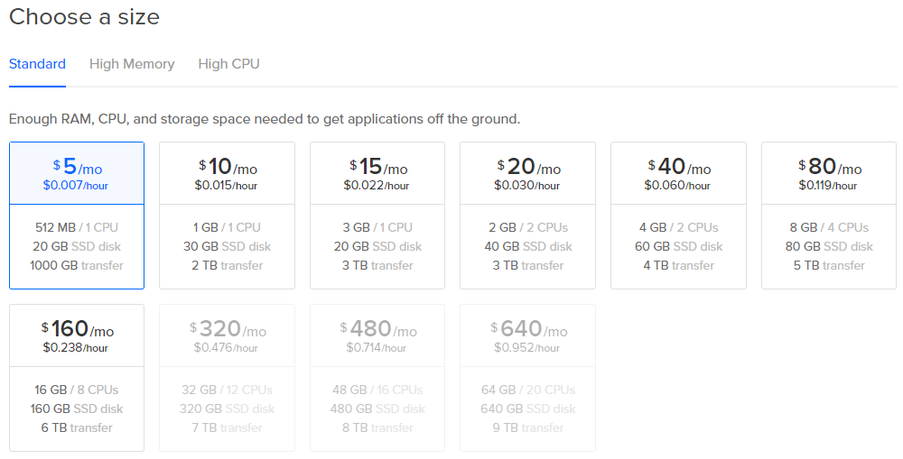
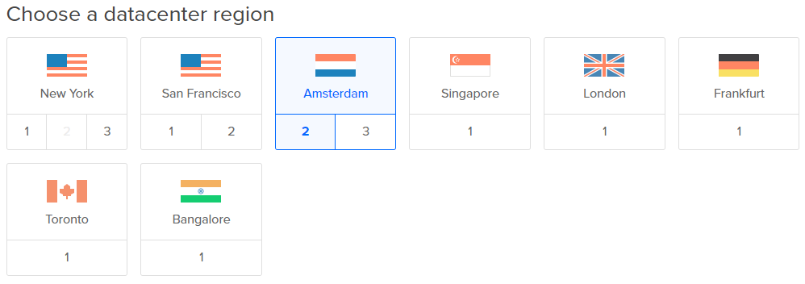
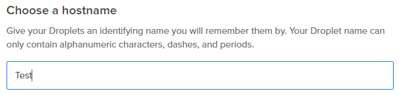
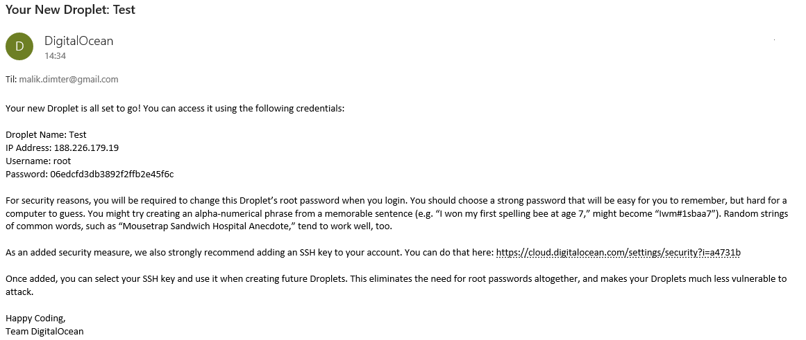
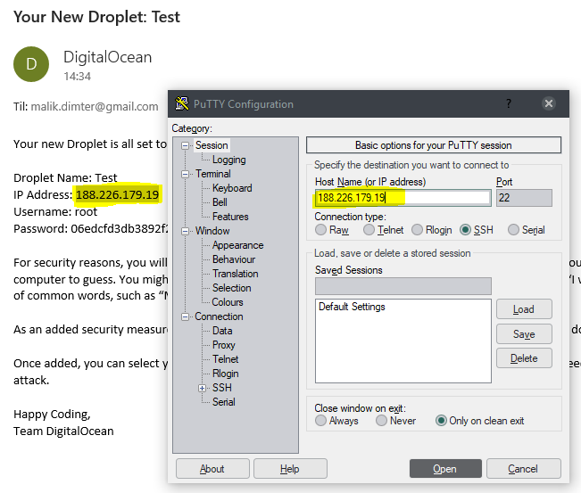
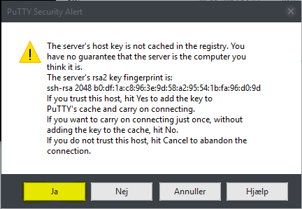
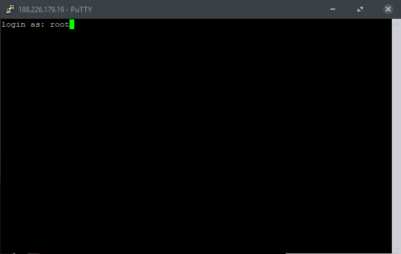
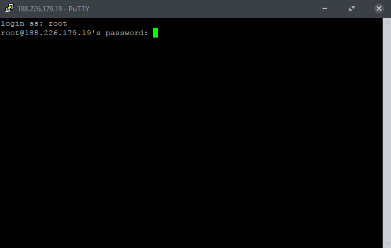

# Digital Ocean Linux Server with Node.js & MySQL
## 1. download and install PuTTY: http://www.putty.org/
## 2. register on Digital Ocean: https://www.digitalocean.com/
## 3. create a Droplet on Digital Ocean https://cloud.digitalocean.com/droplets
###  1. 
###  2. 
###  3. 
###  4. 
###  5. 
###  6. click create!
## 4. connect to your Droplet via PuTTY
###  1. open your E-Mail from Digital Ocean 
###  2. copy IP Address from E-Mail to PuTTY 
###  3. click on "Open" button
###  4. click Yes 
## 5. setup Linux server
###  1. login as root 
###  2. copy your password from your e-mail, paste it in your console (right click) and click return 
###  3. repeat step 2.
###  4. set new password
###  5. install Nano
  * ```yum install nano```
### 6. install MySQL
  * ```yum install mysql-server```
### 7. start MySQL
  * ```service mysqld start```
### 8. config MySQL
  * ```sudo /usr/bin/mysql_secure_installation```
### 9. install Node.js
  * ```yum install epel-release```
  * ```yum install nodejs```
  * ```yum install npm```
  * ```npm install -g n```
### 10. update Node.js
  * ```n lts```
  * ```n```
### 11. restart Linux Droplet

* 

* 

* 

* 

* 
  
### 12. install PM2
  * ```npm install -g pm2```
### 13. start PM2
  * ```pm2 startup```
### 14. install Git
  * ```yum install git```
### 15. config Git
  * ```git config --global user.name "Dit github navn"```
  * ```git config --global user.email "dingithub@email.dk"```
### 16. check config
  * ```nano ~/.gitconfig```
### 17. create SSH key
  * ```ssh-keygen -t rsa```
### 18. open public key
  * ```nano ~/.ssh/id_rsa.pub```
### 19. copy public key to GitHub -> Settings -> SSH and GPG keys -> New SSH key
### 20. create a folder for your project
  * ```mkdir ~/www```
### 21. navigate into your folder
  * ```cd ~/www```
### 20. clone your repository from Github
  * ```git clone git@github.com:brugernavn/repository```
### 21. update with pull
  * ```git pull git@github.com:brugernavn/repository```
